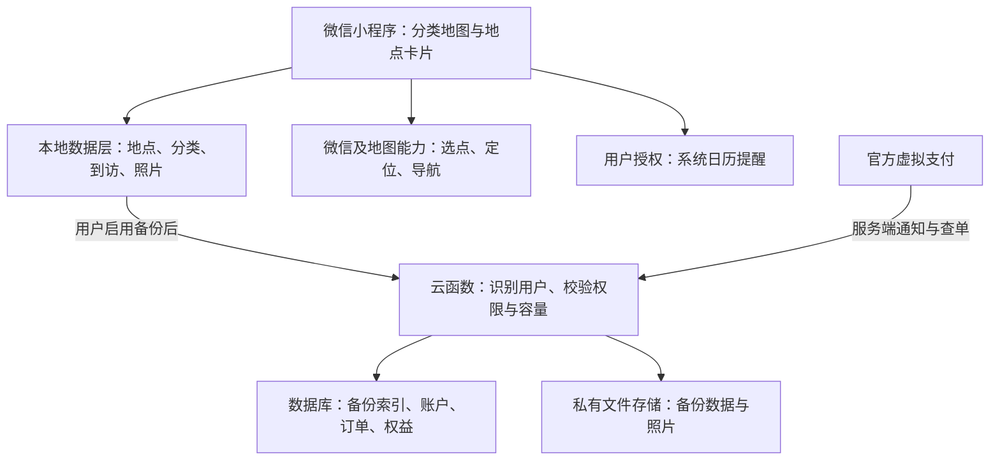

# 个人分类地图小程序实施方案

版本：1.0｜事实核查日期：2026-09-13｜用途：产品决策、开发交接、试用与商业化准备

**建议路线：微信原生小程序，地图作为唯一主界面；先交付本地分类收藏，再增加本应用数据的云备份年包。前置验证类目与定位权限、地图商业使用条件、个人虚拟支付准入。**

本方案不是已经上线的产品，也不是审批通过承诺。文中分为三类：**事实**来自已读取的官方文档或竞品作者原文；**建议**是基于事实和你的需求作出的设计选择；**待验证**需要真实账号、手机测试、平台确认或用户试用才能得出结论。具体价格、容量和验收目标中的建议值，不是行业统计或已验证的付费意愿。

## 1. 产品定义与竞品判断

### 1.1 你的产品要完成的事情

用户在抖音、小红书等平台发现想去的地方，把准确地点存到自己的地图。打开地图后切换美食、宠物、洗车等分类，只看当前需要的收藏，结合当前位置决定去哪；去过后打勾，按需留下照片和感想。

**地图就是产品主界面。分类切换是主操作，不要求用户先进入收藏列表。**

第一版目标用户：与你类似、已经会收藏店铺，但需要按位置和类别重新找到它们的人。多分类能力保留；首次引导用“美食”举例，减少理解成本。

### 1.2 已核实的竞品情况

| 对照对象 | 有证据支持的能力 | 对本项目的影响 |
|---|---|---|
| 少数派文章中的“美食地图” | 作者描述其为本地 iOS 应用，具备地图打卡、照片/视频、评价、导航与备份；可记录待去地点。标签筛选被列入后续计划，收益来自可选支持性内购 | 地图、想去、本地记录和备份都不是独有功能；当前产品版本是否已补上标签，尚未实机验证 |
| 高德收藏 | 官方帮助确认收藏地点、编辑标签及账号云收藏 | 基本地点收藏和云保存已有替代品；不能仅靠这两项证明用户会付费 |
| 你使用的高德版本 | 你反馈地图上混合显示全部收藏，无法按种类切换 | 这是明确的用户体验问题；不扩展成“高德所有版本绝对没有分类地图”的结论 |

来源：[竞品作者原文，2026-06-23](https://sspai.com/post/111203)、[高德官方收藏帮助，旧版说明](https://wap.amap.com/userhelpV7/function8.html)。竞品描述属于作者自述；未核验下载量、收入、留存率或当前商店版本。

**推理：**本项目可以争取的价值是“分类地图更直接、记录原因更方便、收藏后更容易再次使用”。这个差异在交互上成立，是否足够使人持续使用和付费，必须测试，不能由功能表推导出市场成功。

### 1.3 对外表达

建议一句话：“把想去的地方放进自己的分类地图。”

补充说明：“无需注册即可本地记录；云备份自愿开启。”

不宣传“永久不会丢”“完全不联网”“任意平台一键导入”“所有导航 App 都可直接打开”。这些承诺与平台边界或验证状态不符。

## 2. 首先解决的四个准入问题

这四项先于完整页面开发。做演示图和验证小样可以继续，但不能在问题未解决时售卖对应服务。

| 检查项 | 已知事实 | 本项目必须得到的结果 | 未通过时怎么办 |
|---|---|---|---|
| 服务类目与当前位置 | `wx.getLocation` 有类目准入；工具类开放项包含信息查询、办公等；个人工具类也有备忘录 | 实际功能符合所选类目，定位与选点权限获准；不能因为备忘录可注册，就假定它可获取精确定位 | 向平台解释真实场景；若需要其他主体则评估成本。手动参照点只作试验备用，不能宣称已实现当前位置需求 |
| 地图费用与使用条件 | 原生地图可叠加标记；额外位置服务用于商业行为可能涉及授权费 | 确认内置选点、自建搜索接口、商业授权、配额以及允许保存的地图字段；取得具体套餐或书面答复 | 减少额外接口，先用已获准的内置选点；不能以“有免费额度”推定商业免费 |
| 个人虚拟支付 | 官方已开放符合条件的个人工具类小程序，要求认证和备案；同时排除需电信业务资质的服务 | 平台确认本应用的备份权益属于允许销售的服务，定位所需类目与支付所需类目能同时满足 | 先免费试用；必要时评估适当经营主体/资质，或改做获准的本地功能买断；不通过改名字绕过准入 |
| 本地数据带走 | 本地缓存与文件会随代码包清理；文件空间有限 | 两台真机完成记录和照片的导出、导入、核对 | 优先修复；未通过前仅用测试数据，不把产品当长期唯一记录库 |

类目来源：[微信服务类目](https://developers.weixin.qq.com/miniprogram/product/material/)、[定位接口](https://developers.weixin.qq.com/miniprogram/dev/api/location/wx.getLocation.html)、[选择位置接口](https://developers.weixin.qq.com/miniprogram/dev/api/location/wx.chooseLocation.html)。**类目是平台审核分类，和地图内的“美食/宠物”用户分类完全不同。**

商业使用来源：[微信 map 官方文档](https://developers.weixin.qq.com/miniprogram/dev/component/map.html)。个人支付与排除范围来源：[微信虚拟支付：个人](https://developers.weixin.qq.com/miniprogram/dev/platform-capabilities/business-capabilities/virtual-payment/person.html)。

建议向平台提交的业务说明（草稿，不代表平台已认可）：

> 提供私人地点收藏与到访记录：用户自行选择地理位置、按类别筛选，使用当前位置计算距离并调用现成地图导航。记录不向公众展示。拟收费功能仅备份和恢复本应用生成的记录及附属照片，不提供任意文件网盘、公共内容发布或全网搜索。请确认适用类目、位置接口资格、个人虚拟支付准入，以及是否需要额外资质。

## 3. 功能范围与地图交互

### 3.1 V1.0：免费本地试用版

| 模块 | 实施内容 | 验收标准 |
|---|---|---|
| 地图主页 | 主地图、我的位置、分类横栏、想去/去过/全部、添加按钮 | 切到宠物时，自己收藏的美食标记全部移除；返回仍保留分类与视野 |
| 分类管理 | 预设美食/宠物/汽车，允许新增、重命名、排序；初期每个地点一个主分类 | 删除分类时可迁移其地点，不静默删除收藏 |
| 地点添加 | 内置选点优先；支持地图选定坐标后自定义名称；确认城市与分店 | 名称、坐标、分类即可保存；取消或失败不产生半条记录 |
| 种草信息 | 一句话原因、来源平台、用户主动粘贴的链接或文字 | 不需要解析成功才能保存；原帖打不开时仍能看自己的备注 |
| 查看远近 | 当前坐标有效时计算直线距离；区分“当前位置”与“选定参照点” | 不把直线距离标成步行/驾车距离；定位失败不展示伪精确数值 |
| 地点卡片 | 店名、类别、距离、原因、导航、标记去过、更多 | 点击地图标记打开底部卡片，关闭后回到原视野 |
| 去过与到访 | 一键新增到访，可撤销；日期、感想、照片均按需补充 | 同一地点多次到访保留历史，不覆盖旧照片 |
| 本周末 | 用户把地点加入本周末计划，可清除计划 | 计划作为附加筛选，和美食/宠物分类独立 |
| 照片 | 本地保存压缩副本、缩略图、删除和空间提示 | 杀进程重启后仍可看；保存失败有提示；不修改用户相册原图 |
| 手动备份恢复 | 开放数据格式、记录与照片、版本校验、导入预览 | 真机跨设备恢复，重复导入不重复增加相同记录 |
| 设置 | 分类管理、存储用量、导出/恢复、隐私说明、反馈入口 | 不使用云服务也能完成核心操作 |

建议使用场景作为验收目标：至少用 3 个分类、30 个分散地点测试切换；再用 300 个测试地点检查聚合与卡顿。这些是项目测试规模，不是平台性能保证。

地图逻辑：先按分类与状态过滤地点，再聚合过滤后的标记。不能先聚合所有地点再隐藏部分标记，否则聚合数字可能包含不相关类别。

**底图仍有道路、地名及服务商自带标签。**“只显示美食收藏”指自己的收藏图层；不承诺底图上所有其他商业标签自动按你的分类消失。V1 不购买个性化地图皮肤，确有视觉需要时再评估。筛选自建标记本身不依赖个性化底图能力。[地图组件依据](https://developers.weixin.qq.com/miniprogram/dev/component/map.html)

### 3.2 V1.1：云备份收费版

增加微信身份绑定、备份状态、主设备备份、快照恢复、容量与期限、订单和退款处理。首发销售“本应用数据备份年包”，先不承诺双向实时同步。

“自动备份”准确含义：用户开启后，在小程序处于可运行状态且联网时，保存变更后尝试上传；下次打开时续传。界面同时显示“本机已保存”和“上次云备份成功时间”。**未打开期间不承诺持续后台备份。**

第二台设备先选择“恢复备份”或“保留本机记录”，不能刚打开就把空数据上传覆盖旧备份。初期以单一主设备写备份；设备切换需要明确接管，其他设备的数据仍保留，避免假同步。

### 3.3 日历提醒：可独立加入 V1.0.x

事实：微信提供向系统日历添加重复事件的接口，支持每周周期，需要日历授权；添加单次事件另有对应接口。因此先做“每周五提醒我看看收藏”和“某天去某家店”。这是系统日历通知，不是持续响铃的闹钟。[重复日历接口](https://developers.weixin.qq.com/miniprogram/dev/api/device/calendar/wx.addPhoneRepeatCalendar.html)

建议先添加普通文字日历事件，不强依赖回跳链接。官方回跳参数涉及签名，若要做再加入相应后端。事件成功写入与系统最终发出通知分开验证；通知关闭、拒绝权限时明确提示。不要重复创建同一个事件；本版若没有可靠修改/删除能力，提供到系统日历管理的说明。

微信长期订阅消息并非向所有工具开放，不能用一次订阅承诺每周无限推送。将来有匹配模板再增加消息渠道，不把它作为首版提醒前提。[订阅消息总览](https://developers.weixin.qq.com/miniprogram/dev/framework/open-ability/subscribe-message-overview.html)

### 3.4 暂不开发

自动读取抖音/小红书收藏、全网抓取帖子、AI 自动推荐、后台路过提醒、公开点评社区、商家排名、多设备双向同步、视频保存、离线地图、批量行程规划。

理由：这些功能分别增加跨平台接入、权限、费用、内容运营或数据一致性成本；不需要它们也能验证“按分类看自己的地图”。用户主动粘贴来源信息可以先覆盖基本输入需求。

## 4. 前后端架构

### 4.1 技术选择

**建议采用微信原生小程序 + TypeScript + 原生 map 组件；后端选腾讯云 CloudBase 的文档数据库、对象存储、云函数。**

选择依据：产品当前只要求微信端，核心依赖地图与微信原生能力；云开发提供现成后端组件并支持微信身份。这个选择减少自管服务器的工作，不代表无需编写或维护后端。[CloudBase 官方能力](https://tcb.cloud.tencent.com/)

不先搭 ECS/CVM、Kubernetes、自建 MySQL、独立管理后台，也不为尚未确定的 App 选择复杂跨端架构。未来可以复用业务数据格式和算法，地图界面与平台接口通常仍要适配。

用户不启用备份时，不把私人记录发送到自有云端。定位、地图请求仍可能经过平台和地图供应商；不能对外说“全部数据绝不离开设备”。

### 4.2 前端结构与实现顺序

建议代码分为四层：

| 层 | 作用 | 核心要求 |
|---|---|---|
| 页面与组件 | 地图、分类栏、地点卡片、编辑、到访、备份设置 | 页面不直接处理复杂云逻辑 |
| 业务逻辑 | 分类筛选、状态、距离、去重、导入合并 | 与地图 API 解耦，可独立测试 |
| 本地仓库 | 持久化、文件索引、版本升级、写入失败恢复 | 确认写入成功后才提示已保存 |
| 平台适配 | 定位、地图选点、导航、日历、文件传递、云端 | 统一处理取消、拒绝、低版本与失败 |

前端开发流程：假数据地图 → 分类与状态筛选 → 本地增删改 → 选点和当前位置 → 地点卡片与导航 → 到访照片 → 导入导出 → 真机验收 → 云备份入口。

地图首次打开先读本地，避免等待云响应才能显示已有收藏。切换类别不调用地图搜索 API。用户不授权定位时仍能查看、分类和编辑收藏；距离暂隐藏，可让用户手动选参照位置。

### 4.3 数据模型

| 数据 | 最少字段 | 设计理由 |
|---|---|---|
| Category 分类 | id、名称、图标、颜色、排序 | 名称可改，地点关联不受影响 |
| Place 地点 | id、名称、地址、坐标及坐标系、categoryId、种草原因、来源、创建/修改时间 | 不用店名作为唯一键；连锁分店独立 |
| Visit 到访 | id、placeId、到访时间、感想、mediaIds | 多次去同一家店不丢历史 |
| Media 照片 | id、所属记录、相对文件路径、字节数、内容校验值、云状态 | 换机不复用旧设备绝对路径 |
| WeekendPlan 计划 | 日期范围、placeIds | “周末去”不是门店类别 |
| Backup 快照 | id、ownerId、deviceId、版本、清单、完成状态、总字节数、创建时间 | 能识别不完整备份，避免坏副本覆盖好副本 |
| Account / Order / Entitlement | 用户内部ID、微信身份关联、订单、权益起止、容量 | 云数据与付款权益归属于正确用户 |

建议“去过”从有效到访记录推导；一键勾选创建一条简短到访，撤销移除该条。已有历史到访时不能因为撤销最新一次就变回未去过。再次想去使用独立标志或周末计划。

全局 ID 在本地创建，导入时保留；数据加入 `schemaVersion`。地图坐标统一使用适用的 GCJ-02，外部来源坐标保留来源与坐标系，禁止把不同坐标系的数值直接混用。[微信定位坐标说明](https://developers.weixin.qq.com/miniprogram/dev/api/location/wx.getLocation.html)

### 4.4 本地存储与照片

**官方现行文档：键值缓存 storage 上限 10MB；本地缓存文件与用户文件合计最多 200MB；缓存/用户文件随代码包清理。临时文件不保证下次启动可用。**来源：[存储](https://developers.weixin.qq.com/miniprogram/dev/framework/ability/storage.html)、[文件系统](https://developers.weixin.qq.com/miniprogram/dev/framework/ability/file-system.html)。

实施建议：

- 小型设置放键值缓存；记录按合理粒度持久化，避免整个数据库反复塞进同一个键。照片存文件，不转 Base64 塞进 storage。
- 图片压缩到适合回看与备注的尺寸，建立缩略图；不把“保存压缩副本”宣传成“备份相册原图”。
- 本地写入先生成新版本并校验，再切换索引，保留可恢复的上一个版本；异常退出不应写坏全部数据。
- 依据实际占用设置空间预警，预留更新、解压和恢复空间。不能把 200MB 全拿来存照片。
- 容量不足时保留文字编辑和导出能力；未备份照片不自动删除。所有清理操作先说明影响。

### 4.5 手动备份与换机

建议格式：`manifest.json` + 分类/地点/到访 JSON + 照片文件；可以打包为 ZIP。格式公开、有版本号、有文件大小及校验信息。不把旧手机 `wxfile://` 路径作为恢复依据。

实现路径：本机生成文件 → 用户选择转发到聊天 → 新手机从会话选择文件 → 展示内容摘要 → 用户确认导入。微信提供文件转发和从会话选择文件接口；打包、校验、冲突处理由本项目开发。[文件转发](https://developers.weixin.qq.com/miniprogram/dev/api/share/wx.shareFileMessage.html)、[会话选文件](https://developers.weixin.qq.com/miniprogram/dev/api/media/image/wx.chooseMessageFile.html)

**经微信聊天传递会把备份交给微信传输，并非完全离线迁移，也不等于微信替用户永久保管。**界面必须说明传递路径，建议另存可信位置。若未来需要端到端加密备份，单独设计密码和恢复机制，不能只给 ZIP 改后缀就称为加密。

恢复时先检查版本、大小、缺失文件和路径安全；相同 ID 内容一致则跳过，不同内容保留冲突副本供选择，禁止静默覆盖。大备份采用分段或按需恢复，先在目标手机验证内存与临时空间。

### 4.6 导航

优先验证 `MapContext.openMapApp`：官方说明可拉起地图 App 选择导航，并支持推荐高德、百度、腾讯、苹果等选项。它是推荐/选择机制，不保证任意设备都安装了对应 App。[导航接口](https://developers.weixin.qq.com/miniprogram/dev/api/media/map/MapContext.openMapApp.html)

兼容方案：失败或不可用时使用 `wx.openLocation` 打开微信位置页，再提供复制地址。开发验收要检查目的地坐标准确、不同分店不混淆、取消返回原页面。先不自建路线算法。

## 5. 后端开发流程

### 5.1 身份与隐私

本地模式不设置强制注册页。启用云端后，根据微信身份建立内部账户；用户无需自设密码，也不必提供手机号和昵称。后端必须识别所有者，不能采用“无身份共享一个云目录”。[微信登录机制](https://developers.weixin.qq.com/miniprogram/dev/framework/open-ability/login.html)

CloudBase 云函数可获取可信微信身份；支付若需要用户态签名，按官方流程在服务器换取并保管会话密钥。OpenID、用户ID不能仅相信前端上传的参数；支付密钥、session_key 不下发到小程序。[云身份能力](https://tcb.cloud.tencent.com/)、[支付签名与发货要求](https://developers.weixin.qq.com/miniprogram/dev/platform-capabilities/business-capabilities/virtual-payment/person.html)

启用云备份前告知上传范围。只需临时用于算距离的当前位置，不默认保存成云端轨迹。云照片不公开，授权范围按用户隔离；反馈日志避免包含照片、完整备注和精确坐标。

### 5.2 备份服务

1. 建立开发/测试环境和正式环境隔离，配置私有存储、数据库规则和服务端密钥。
2. 完成云用户身份校验，再实现容量、权益和设备接管规则。
3. `prepareBackup`：接收文件清单与版本，计算需要上传的文件，检查并预留容量。
4. 上传文件：只允许上传属于当前用户和该次备份的对象；失败可重试。
5. `commitBackup`：校验文件是否齐全，完成后才将新快照标为可恢复。
6. `listBackups / restoreBackup`：只返回当前用户的快照和临时授权下载地址。
7. `deleteBackup / deleteCloudData`：明确数据删除范围；清理不再被有效快照引用的文件，避免误删其他快照使用的照片。
8. 展示恢复摘要、最近成功时间、未上传数量和剩余容量。

以上接口名是建议设计，不是微信已有 API。

容量应统计实际保留文件与历史快照占用；相同照片可复用同一私有对象，避免每次全量复制产生大量费用。**用户可恢复的历史版本必须实际保存，不能把“同步最新一份”宣传成防误删备份。**

若云套餐容量大于本地可用空间，恢复采用“记录先恢复、照片按需加载”，本地只缓存一部分已经在云端验证完整的照片；未上传的本机照片不属于可清理缓存。全量导出分段处理。上线前专门测试超出本地容量的云账户，否则不要售卖大容量套餐。

### 5.3 收费与权益服务

服务端创建订单 → 前端发起官方支付 → 服务端验证平台通知/查单 → 记录已付款 → 开通权益 → 客户端刷新状态。

必须处理：付款后用户退出、通知重复、通知延迟、金额或商品不匹配、订单归属不符、退款、续费。不能只根据前端“支付成功”回调增加会员天数。

建议用内部订单状态区分待支付、支付已确认、权益已发放、退款处理中、已退款；重复通知不重复发放。实际续费起点规则在商品说明中固定，不能随页面时间或设备时间改变。

运营只需要先有订单查询、失败备份统计、用量监控和反馈处理。初期通过受权限控制的云控制台或少量内部工具完成，不先开发一套庞大后台。

## 6. 变现方案与经营条件

### 6.1 推荐商品

| 商品 | 建议内容 | 为什么 |
|---|---|---|
| 免费基础版 | 分类地图、地点、到访、基本照片、手动备份恢复 | 先让用户建立使用习惯，不把核心分类功能藏在付款后 |
| 云备份年包 | 限定容量、自动上传、历史快照、换机恢复 | 持续服务对应持续收费 |
| 后续本地专业版 | 批量整理、高级筛选、回顾导出等明确功能 | 如存在实际需求，可一次购买功能使用权；与云成本分开 |

**首轮建议只测试一个年包，例如 ¥49/年；这是价格实验，不是市场事实。**容量在压缩照片样本和云账单验证后确定；不得边卖边临时改变已承诺容量。首轮不做自动续扣，只售固定服务期限，降低扣款与取消流程复杂度。

不以“换手机必须付钱”作为设计：手动迁移免费，自动云恢复付费。也不卖低价永久无限存储，不把广告、商家付费排名作为早期主收入。商业判断依据是私人地图的使用过程应保持直接，而非已有证据证明广告必然失败。

### 6.2 当前已确认的个人虚拟支付事实

微信官方个人通道要求个人主体、居民身份证、工具类目、完成认证与备案；月支付限额 10 万元。当前页面列明 Android 等终端费率 1%、iOS 12%，结算分别为 T+3 和约 45—60 天。实际开通合同及平台最新规则优先。[官方原文](https://developers.weixin.qq.com/miniprogram/dev/platform-capabilities/business-capabilities/virtual-payment/person.html)

同一文档排除需要电信业务相关资质的服务，并列出储存转发、信息发布平台、信息搜索查询等例子。**不能据此直接判定本应用备份一定被禁止，也不能直接认定它一定被允许。**必须提交第 2 节的真实业务说明核实；服务名称改成“会员”不改变实际业务性质。

普通微信支付与个人虚拟支付不是同一准入通道。普通小程序支付列明个体工商户、企业等主体，不能把它的结论覆盖到个人虚拟支付上。[普通小程序支付官方准入](https://pay.wechatpay.cn/doc/v3/merchant/4015459512)

个人通道满足时可先个人运营；若类目、资质或发展阶段要求经营主体，再评估个体工商户或公司。注册经营主体本身也不等于自动获得业务许可。税务申报、用户发票需求和经营登记应按实际经营方式向主管部门或专业人员确认，支付限额不是免税额度。

### 6.3 服务到期与退款

建议到期后停新增云备份，本地记录继续可读写；提供事先约定的导出/恢复宽限期，期限届满前提醒。宽限期长度、历史版本数、删除规则、暂停经营时的数据带走方式写进商品说明和协议。可以试拟 30 天，但这是运营建议，不能先向用户承诺再不做实现。

退款按平台渠道处理，并更新服务权益；不因退款自动清除用户唯一的本地记录。订单记录依法保留与用户照片删除分开处理。提供联系方式，不能把支付成功后无法恢复的问题全部推给云供应商。

## 7. 成本与定价怎样计算

### 7.1 已有价格证据

截至核查日，CloudBase 官方定价页列有免费体验环境，以及限时 ¥19.9/月个人版、¥199/月标准版；付费套餐支持超限按量。免费版有配额与续期条件，不是无限免费。[官方价格](https://tcb.cloud.tencent.com/pricing)

这些是资源环境价格，不包含所有地图费用、认证、支付、税费和人工。也不代表最低套餐具备你需要的全部恢复与运维能力。上线前核对具体环境的可用能力，并配置配额、告警及请求限流。

### 7.2 成本清单

| 成本项 | 计算依据 | 当前状态 |
|---|---|---|
| 小程序认证与经营主体 | 后台认证报价、是否需要经营登记 | 尚未实际选择，不给总价承诺 |
| 云基础环境 | 套餐及环境数量 | 有官方报价；开发与正式环境分别计入 |
| 照片与历史备份 | 实际总字节数、版本保留、读写和下载 | 必须用真实样本测量 |
| 地图与搜索 | 组件、接口、商业授权、日请求峰值 | 需服务商确认 |
| 支付渠道 | 成交金额 × 实际终端费率 | 个人通道已有文档费率，资格仍需核实 |
| 退款、税费、服务维护 | 实际交易、税务和服务安排 | 必须计入，不能当作零 |

收入示例，仅计算支付费率影响：如果年包卖 ¥49，按上述费率，Android 扣该项费用后为 ¥48.51，iOS 为 ¥43.12；这都不是利润。¥19.9/月按不变价格连续 12 个月为 ¥238.80，也不是完整年度成本预测。

建议公式：

`年度经营结余 = 年度实收 - 渠道费 - 退款影响 - 税费 - 云资源 - 地图资源 - 认证/主体成本 - 维护人工`

定价前用试用样本测：每人地点数、照片总量、每月新增照片、备份次数、恢复流量、搜索调用数。不要用“10 个付费用户就能盈利”这样的计算忽略其余成本。价格是否可接受只由实际购买实验验证。

## 8. 开发与上线实施顺序

以下是按依赖关系安排的阶段，不是工期承诺。定位审核、备案、支付审核与真机问题会影响时间；目前没有足够数据给出可信的固定天数或外包总价。

| 阶段 | 开发工作 | 你需要做的事 | 进入下一阶段的条件 |
|---|---|---|---|
| A：权限与样机 | 地图、分类假数据、真实定位、选点、导航、日历、含图备份小样 | 拟定名称、注册/认证/备案资料准备，确认主体；提供真实使用场景 | 确认核心权限可获准；两种手机完成关键流程；地图成本可接受 |
| B：本地 V1 | 前端、记录模型、可靠本地写入、照片、导入导出、设置 | 整理自己真实想去的地点，体验并指出阻碍 | 分类正确、数据重启不丢、恢复无损、无严重故障 |
| C：朋友试用 | 上传体验版，收集问题，修复地图和存储体验 | 邀请愿意真实使用的朋友，添加为体验成员 | 用户能不经解释完成收藏→分类查找→导航；能够跨周复用 |
| D：云端免费验证 | 身份、私有云文件、快照、容量、恢复、监控 | 确认上传说明；用自己的两台设备做换机演练 | 越权测试、断网重试、坏备份和跨设备恢复通过 |
| E：收费接入 | 官方支付、回调、查单、权益、到期、退款 | 完成支付准入及签约；批准具体商品和价格 | 资格确认，支付与权益一致，服务与退款条款完整 |
| F：正式发布 | 隐私与接口配置检查、提审、发布、回退准备 | 完成主办者核验及备案；提交审核需要的信息 | 正式审核通过；生产环境关键流程通过 |
| G：扩展 | 根据需求决定多设备同步或 App | 根据真实留存、付费与维护成本作决策 | 有证据说明投入能解决已有问题 |

朋友试用的官方路径为上传开发版本、设置体验版本、添加体验成员。体验版不等于正式公开发布；用户使用你的免费试用版不需要付购买费用，资源消耗由项目承担。[微信发布流程](https://developers.weixin.qq.com/miniprogram/dev/framework/quickstart/release.html)

所有实名认证、平台协议签署和付费购买由你在自己账号下完成。代码、云账号、小程序 AppID、地图 Key 都应归你控制，给开发者按需权限。项目密钥不写进前端代码或公开仓库。

### 8.1 朋友试用怎么判定有价值

建议先邀请约 10 位符合场景的朋友，跨两个周末观察。这个人数和时间是小规模验证建议，不是统计学证明。

只记录必要的使用情况或通过访谈回收：是否能加店、是否用分类地图重新找到店、是否从地图决定出行、是否愿意继续保留记录。愿意提供反馈的朋友可以本地查看使用摘要后主动发给你；不要为了分析默默上传完整收藏位置。

如果只在第一天试过，之后没有再打开，应先修正添加入口和地图查找体验。若用户持续使用但不愿买云备份，继续测试服务价值和价格，不假设“照片多了就会付费”。

### 8.2 开发验收必须覆盖

- 分类切换只显示匹配收藏；状态、周末筛选叠加正确；聚合计数正确。
- 同名分店、重复地点、改分类、误点去过、删除分类都有可理解的处理。
- 拒绝定位、关闭相册/日历权限、离线、弱网、地图超额时可继续基本记录。
- 保存中退出、空间不足、版本升级、备份文件损坏时不静默损坏已有数据。
- 免费导出恢复包含照片；跨 iPhone/安卓、重复导入和版本迁移经过测试。
- 云端用户 A 无法访问或修改 B 的记录/照片；不能伪造容量和会员期限。
- 新设备空数据不能覆盖云备份；上传不完整不能变成最新有效备份。
- 云容量大于本机容量时仍能恢复记录、浏览照片和分段导出。
- 支付取消、通知重复/丢失、退出后重新进入、退款都能正确更新权益。
- 平台审核、地图商用条件、客服与隐私说明和实际功能一致。

## 9. 大陆上线手续

依据工信部通知，在大陆从事互联网信息服务的 APP 主办者需要履行备案，分发平台范围包含小程序。没有买自有服务器不构成豁免。材料齐全准确时，通知规定通信管理局在 20 个工作日内备案；这不包括前期资料补正和微信审核的全部时间。[工信部通知](https://www.gov.cn/zhengce/zhengceku/202308/content_6897341.htm?type=mobile-internet)

准备清单：主体和负责人资料、名称与介绍、真实服务类目、备案信息、隐私保护指引、所用位置/图片接口声明与权限、地图供应商配置、反馈渠道；收费时再加支付准入、商品与服务条款、退款和到期数据政策。地图、定位、照片如何处理应如实说明。[微信隐私适配的腾讯官方说明](https://cloud.tencent.cn/document/product/1301/97930)

APP/小程序备案、微信认证、代码审核、业务许可、地图授权是不同事项。是否另需电信或其他许可应按真实业务核实，不能以收费与否一个条件直接判断。只使用合规底图和供应商能力，不自行制作发布底图，不去除要求展示的地图标识；具体商用与数据保存约束落实到服务商协议。

## 10. 何时再做 App

出现以下已经被观察到的需求，再评估 App：用户需要大量本地照片；小程序备份导出长期不顺畅；更强离线访问、系统分享导入或本地通知成为主要需求；用户愿意安装并持续使用。

App 的潜在收益来自更直接的本地文件与系统集成，但仍需平台授权、备份、支付、地图服务和大陆分发手续，不会自动消除成本与准入。届时继续使用稳定的数据模型和云服务，重新实现对应平台界面及身份关联；不承诺现有前端代码直接变 App。

## 11. 决策结论

现在值得推进的是 **“个人分类地图 V1 + 权限和备份验证”**。最先实现的差异是地图上按种类切换自己的收藏；云备份是后续有条件成立的收入路径。

在本次核查后，以下事项已经不再只是猜测：个人工具小程序存在官方虚拟支付通道；官方提供地图 App 导航选择与每周日历事件接口；本地存储存在明确配额与清理边界。

仍不能由公开资料替你完成的决定是：你的实际类目和定位申请能否通过、本应用备份收费是否符合准入、地图商用总价、实际手机体验、用户是否付费。开发顺序已将这些问题提前，不以“先把所有页面写完”作为项目成功标准。

详细核查范围见[事实核查与待验证清单](/Users/patrick/Downloads/project/map/事实核查与待验证清单.md)。
