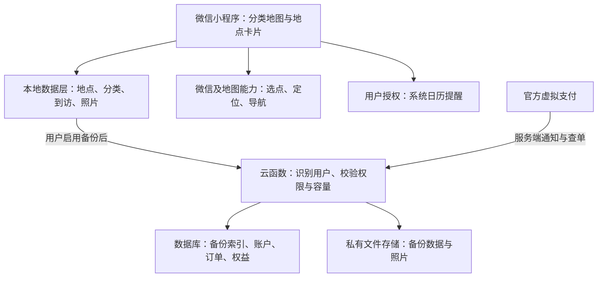

# 个人分类地图小程序实施方案

版本：1.1（三角色独立评审修订）｜修订日期：2026-09-13｜事实依据核查日期：2026-09-13｜用途：产品决策、开发交接、试用与商业化准备

本版经产品经理、程序员、运营三个独立 AI 评审角色分别审阅后综合修订；不代表真人持证专家背书或平台批准。原 1.0 版保留。意见、采纳情况和取舍见[独立评审与修改记录](/Users/patrick/Downloads/project/map/三角色独立评审与修改记录.md)。

**建议路线：先做 V0 分类地图任务验证，再做 V1.0 可靠本地版，最后验证 V1.1 有限数据集云备份年包。地图始终是主界面；收费前确认实际业务准入和全年履约成本。首个收费版不出售照片扩容。**

本方案不是已经上线的产品，也不是审批通过承诺。文中分为三类：**事实**来自已读取的官方文档或竞品作者原文；**建议**是基于事实和你的需求作出的设计选择；**待验证**需要真实账号、手机测试、平台确认或用户试用才能得出结论。具体价格、容量和验收目标中的建议值，不是行业统计或已验证的付费意愿。

## 1. 产品定义与竞品判断

### 1.1 你的产品要完成的事情

用户在抖音、小红书等平台发现想去的地方，把准确地点存到自己的地图。打开地图后切换美食、宠物、洗车等分类，只看当前需要的收藏，结合当前位置决定去哪；去过后打勾，按需留下照片和感想。

**地图就是产品主界面。分类切换是主操作，不要求用户先进入收藏列表。**

第一版目标用户：与你类似、已经会收藏店铺，但需要按位置和类别重新找到它们的人。多分类能力保留；首次引导用“美食”举例，减少理解成本。

### 1.2 已核实的竞品情况

| 对照对象 | 有证据支持的能力 | 对本项目的影响 |
|---|---|---|
| 少数派文章中的“美食地图” | 作者描述其为本地 iOS 应用，具备地图打卡、照片/视频、评价、导航与备份；可记录待去地点。标签筛选被列入后续计划，收益来自可选支持性内购 | 地图、想去、本地记录和备份都不是独有功能；当前产品版本是否已补上标签，尚未实机验证 |
| 高德收藏 | 官方帮助确认收藏地点、编辑标签及账号云收藏 | 基本地点收藏和云保存已有替代品；不能仅靠这两项证明用户会付费 |
| 你使用的高德版本 | 你反馈地图上混合显示全部收藏，无法按种类切换 | 这是明确的用户体验问题；不扩展成“高德所有版本绝对没有分类地图”的结论 |

来源：[竞品作者原文，2026-06-23](https://sspai.com/post/111203)、[高德官方收藏帮助，旧版说明](https://wap.amap.com/userhelpV7/function8.html)。竞品描述属于作者自述；未核验下载量、收入、留存率或当前商店版本。

**推理：**本项目可以争取的价值是“分类地图更直接、记录原因更方便、收藏后更容易再次使用”。这个差异在交互上成立，是否足够使人持续使用和付费，必须测试，不能由功能表推导出市场成功。

### 1.3 对外表达

建议一句话：“把想去的地方放进自己的分类地图。”

补充说明：“无需注册即可本地记录；云备份自愿开启。”

不宣传“永久不会丢”“完全不联网”“任意平台一键导入”“所有导航 App 都可直接打开”。这些承诺与平台边界或验证状态不符。

## 2. 首先解决的四个准入问题

这四项从阶段 A 同时启动，按不同阶段分别放行：定位与选点是核心地图依赖；可靠备份是长期本地版依赖；地图商业使用与支付准入是商业化依赖。未解决的云收费问题不阻挡无收费的地图小样，但不排定完整收费版承诺工期、不收预售款。平台答复也不能替代主管部门对法定许可的判断。

| 检查项 | 已知事实 | 本项目必须得到的结果 | 未通过时怎么办 |
|---|---|---|---|
| 服务类目与当前位置 | `wx.getLocation` 有类目准入；工具类开放项包含信息查询、办公等；个人工具类也有备忘录 | 实际功能符合所选类目，定位与选点权限获准；不能因为备忘录可注册，就假定它可获取精确定位 | 向平台解释真实场景；若需要其他主体则评估成本。手动参照点只作试验备用，不能宣称已实现当前位置需求 |
| 地图费用与使用条件 | 原生地图可叠加标记；额外位置服务用于商业行为可能涉及授权费 | 确认内置选点、自建搜索接口、商业授权、配额以及允许保存的地图字段；取得具体套餐或书面答复 | 减少额外接口，先用已获准的内置选点；不能以“有免费额度”推定商业免费 |
| 个人虚拟支付 | 官方已开放符合条件的个人工具类小程序，要求认证和备案；同时排除需电信业务资质的服务 | 平台确认本应用的备份权益属于允许销售的服务，定位所需类目与支付所需类目能同时满足 | 先免费试用；必要时评估适当经营主体/资质，或改做获准的本地功能买断；不通过改名字绕过准入 |
| 本地数据带走 | 本地缓存与文件会随代码包清理；文件空间有限 | 两台真机完成记录和照片的导出、导入、核对 | 优先修复；未通过前仅用测试数据，不把产品当长期唯一记录库 |

类目来源：[微信服务类目](https://developers.weixin.qq.com/miniprogram/product/material/)、[定位接口](https://developers.weixin.qq.com/miniprogram/dev/api/location/wx.getLocation.html)、[选择位置接口](https://developers.weixin.qq.com/miniprogram/dev/api/location/wx.chooseLocation.html)。**类目是平台审核分类，和地图内的“美食/宠物”用户分类完全不同。**

商业使用来源：[微信 map 官方文档](https://developers.weixin.qq.com/miniprogram/dev/component/map.html)。个人支付与排除范围来源：[微信虚拟支付：个人](https://developers.weixin.qq.com/miniprogram/dev/platform-capabilities/business-capabilities/virtual-payment/person.html)。

建议向平台提交的业务说明（草稿，不代表平台已认可）：

> 提供私人地点收藏与到访记录：用户自行选择地理位置、按类别筛选，使用当前位置计算距离并调用现成地图导航。记录不向公众展示。拟收费功能仅备份和恢复本应用生成的记录及附属照片，不提供任意文件网盘、公共内容发布或全网搜索。请确认适用类目、位置接口资格、个人虚拟支付准入，以及是否需要额外资质。

## 3. 功能范围与地图交互

### 3.0 V0：分类地图任务验证小样

仅做添加准确地点、分类切换、当前位置与直线距离、附近卡片、导航、待去/去过和文字导出。用测试数据或用户已有副本，说明暂不作为长期唯一记录库；不急着接照片、计划、日历、支付或云服务。V0 可以邀请朋友做受控任务测试。

核心任务从真实种草内容开始：复制店名或分享文字 → 打开小程序 → 选点确认分店 → 保存 → 切换类别查找 → 决定是否前往。观察跨应用切换和分店确认的阻力，而不只测试已经填好的地图。名称、位置、分类必填，默认上次分类，来源与原因选填。

### 3.1 V1.0：可靠本地试用版

| 模块 | 实施内容 | 验收标准 |
|---|---|---|
| 地图主页 | 主地图、我的位置、分类横栏、待去/去过/全部、添加按钮、附近卡片条 | 切到宠物时只显示宠物收藏；保留视野并显示匹配总数和屏内数量 |
| 分类管理 | 预设美食/宠物/汽车，允许新增、重命名、排序；初期每个地点一个主分类 | 删除分类时可迁移其地点，不静默删除收藏 |
| 地点添加 | 内置选点优先；支持地图选定坐标后自定义名称；确认城市与分店 | 名称、坐标、分类即可保存；取消或失败不产生半条记录 |
| 种草信息 | 一句话原因、来源平台、用户主动粘贴的链接或文字 | 不需要解析成功才能保存；原帖打不开时仍能看自己的备注 |
| 查看远近 | 按有效当前位置计算直线距离；底部可收起卡片条按当前筛选结果排序，包含屏外收藏 | 点卡片定位标记；距离不是路线距离；定位失效则隐藏实时距离或标明更新时间 |
| 地点卡片 | 店名、类别、距离、原因、导航、标记去过、更多 | 点击地图标记打开底部卡片，关闭后回到原视野 |
| 去过与到访 | 一键新增到访，可撤销；日期、感想、照片均按需补充 | 同一地点多次到访保留历史，不覆盖旧照片 |
| 照片 | 本地保存压缩副本、缩略图、删除和空间提示 | 杀进程重启后仍可看；保存失败有提示；不修改用户相册原图 |
| 手动备份恢复 | 开放格式、含图完整备份、独立预览、确认后整体恢复；当前数据先保护 | 两台真机恢复后记录及照片一致；重复恢复不产生重复记录 |
| 设置 | 分类管理、存储用量、导出/恢复、隐私说明、反馈入口 | 不使用云服务也能完成核心操作 |

建议使用场景作为验收目标：至少用 3 个分类、30 个分散地点测试切换；再用 300 个测试地点检查聚合与卡顿。这些是项目测试规模，不是平台性能保证。

地图逻辑：先按分类与状态过滤地点，再聚合过滤后的标记。不能先聚合所有地点再隐藏部分标记，否则聚合数字可能包含不相关类别。

地图交互规则（设计建议，纳入验收）：

1. 初次默认“全部分类＋待去”，之后记住选择；这个默认值可根据试用结果调整。
2. 切换类别保持视野，显示“匹配 N 个／当前视野 M 个”。屏外有结果时提供“查看匹配全部地点”；“回到我的位置”单独操作。用户拖动后不反复自动回中。
3. 空状态分三种：分类没有收藏→添加；筛选无结果→清除筛选；结果在屏外→查看这些地点。不能都显示“没有店”。
4. 底部“附近收藏”按全部匹配结果的直线距离排序，卡片注明该范围；地图拖动不会把距离起点悄悄改为屏幕中心。点卡片和点标记打开同一详情，不另设列表主页。
5. “去过”是历史事实，“待去”是当前意图；去过的店可再次待去。新收藏默认待去，一键去过完成当前待去；可撤销，也可点“再去一次”。
6. 同名分店确认地址；疑似重复地点提示打开原记录或明确新增，不自动合并不同分店。
7. 底图故障时保留本地地点名称、地址、备注的辅助入口；这是故障降级，不改变地图主页定位，也不承诺离线底图。

**底图仍有道路、地名及服务商自带标签。**“只显示美食收藏”指自己的收藏图层；不承诺底图上所有其他商业标签自动按你的分类消失。V1 不购买个性化地图皮肤，确有视觉需要时再评估。筛选自建标记本身不依赖个性化底图能力。[地图组件依据](https://developers.weixin.qq.com/miniprogram/dev/component/map.html)

### 3.2 V1.1：云备份收费版

增加微信身份绑定、备份状态、主设备备份、快照恢复、容量与期限、订单和退款处理。首发商品只备份 V1.0 已验证能在支持手机上完整恢复的本地数据集，云空间另用于约定的历史版本；**不提供额外照片扩容，不实现按需照片库，也不承诺双向实时同步。**

本地数据集的最大字节数和照片规格先通过空间测试确定；首个年包的单快照上限沿用该边界。历史版本数和总云容量另行核算。不能拿更大的云容量包装成本机可保存更多照片。

“自动备份”准确含义：用户开启后，在小程序处于可运行状态且联网时，保存变更后尝试上传；下次打开时续传。界面同时显示“本机已保存”和“上次云备份成功时间”。**未打开期间不承诺持续后台备份。**

第二台设备先选择“恢复备份”或“保留本机记录”，不能刚打开就把空数据上传覆盖旧备份。初期以单一主设备写备份；设备切换需要明确接管，其他设备的数据仍保留。接管前对照本机与云端摘要，服务端递增写入代次，旧设备上传任务不能再提交为最新备份，详见 §5.2。

备份入口固定在设置及保存状态附近，本地模式不强推登录。开通页展示上传范围、容量、触发条件、历史版本、恢复和到期规则；不等用户空间快满才用弹窗促销。

### 3.3 “计划去”与日历提醒：V1.0.x 可选增强

“计划去”支持单次日期，提供“本周末”快捷选项；计划独立于分类。过期计划不自动标记去过，可重新安排或清除。此模块不阻挡地图 V0 和可靠本地 V1.0 验证。

事实：微信提供向系统日历添加重复事件的接口，支持每周周期，需要日历授权；添加单次事件另有对应接口。因此先做“每周五提醒我看看收藏”和“某天去某家店”。这是系统日历通知，不是持续响铃的闹钟。[重复日历接口](https://developers.weixin.qq.com/miniprogram/dev/api/device/calendar/wx.addPhoneRepeatCalendar.html)

建议按钮命名“添加到系统日历”，先添加普通文字事件，不强依赖回跳。官方回跳参数涉及签名，若要做再加入相应后端。小程序只记录请求结果与时间，不能把本地标志当作系统日历当前状态；用户可能已在系统日历删除事件。再次添加时提示已有添加记录并由用户确认。

事件成功写入与系统最终发出通知分开验证；拒绝权限时明确提示，通知设置需用户在系统中确认。删除地点、清除计划不等于删除已添加的日历事件；未具备可靠修改/删除能力前，明确需去系统日历管理。

微信长期订阅消息并非向所有工具开放，不能用一次订阅承诺每周无限推送。将来有匹配模板再增加消息渠道，不把它作为首版提醒前提。[订阅消息总览](https://developers.weixin.qq.com/miniprogram/dev/framework/open-ability/subscribe-message-overview.html)

### 3.4 暂不开发

自动读取抖音/小红书收藏、全网抓取帖子、AI 自动推荐、后台路过提醒、公开点评社区、商家排名、多设备双向同步、视频保存、离线地图、批量行程规划。

理由：这些功能分别增加跨平台接入、权限、费用、内容运营或数据一致性成本；不需要它们也能验证“按分类看自己的地图”。用户主动粘贴来源信息可以先覆盖基本输入需求。

## 4. 前后端架构

### 4.1 技术选择

**建议采用微信原生小程序 + TypeScript + 原生 map 组件；后端选腾讯云 CloudBase 的文档数据库、对象存储、云函数。**

选择依据：产品当前只要求微信端，核心依赖地图与微信原生能力；云开发提供现成后端组件并支持微信身份。这个选择减少自管服务器的工作，不代表无需编写或维护后端。[CloudBase 官方能力](https://tcb.cloud.tencent.com/)

不先搭 ECS/CVM、Kubernetes、自建 MySQL、独立管理后台，也不为尚未确定的 App 选择复杂跨端架构。未来可以复用业务数据格式和算法，地图界面与平台接口通常仍要适配。

用户不启用备份时，不把私人记录发送到自有云端。定位、地图请求仍可能经过平台和地图供应商；不能对外说“全部数据绝不离开设备”。

### 4.2 前端结构与实现顺序

建议代码分为四层：

| 层 | 作用 | 核心要求 |
|---|---|---|
| 页面与组件 | 地图、分类栏、地点卡片、编辑、到访、备份设置 | 页面不直接处理复杂云逻辑 |
| 业务逻辑 | 分类筛选、状态、距离、去重、整体恢复校验 | 与地图 API 解耦，可独立测试 |
| 本地仓库 | 持久化、文件索引、版本升级、写入失败恢复 | 确认写入成功后才提示已保存 |
| 平台适配 | 定位、地图选点、导航、日历、文件传递、云端 | 统一处理取消、拒绝、低版本与失败 |

前端开发流程：假数据地图 → 分类/意图筛选与附近卡片 → 选点、当前位置、导航与文字导出 → V0 任务验证 → 可靠本地写入与到访照片 → 含图整体恢复 → V1.0 真机验收 → 有限数据集云备份。计划与日历作为独立增强，不阻塞前一阶段。

地图首次打开先读本地，避免等待云响应才能显示已有收藏。切换类别不调用地图搜索 API。用户不授权定位时仍能查看、分类和编辑收藏；距离暂隐藏，可让用户手动选参照位置。

### 4.3 数据模型

| 数据 | 最少字段 | 设计理由 |
|---|---|---|
| Category 分类 | id、名称、图标、颜色、排序 | 名称可改，地点关联不受影响 |
| Place 地点 | id、名称、地址、坐标及坐标系、categoryId、wantToVisit、种草原因、来源、创建/修改时间 | 待去意图独立于历史；不用店名作为唯一键 |
| Visit 到访 | id、placeId、到访时间、感想、mediaIds | 多次去同一家店不丢历史 |
| Media 照片 | id、所属记录、相对文件路径、字节数、校验值、稳定云对象ID、localState、cloudState、deletedAt | 缺少本地文件不等于用户删除；状态分别记录 |
| VisitPlan 计划（V1.0.x） | id、计划日期、placeIds、状态 | 日期过期不自动变成去过 |
| Backup 快照 | id、ownerId、deviceId、writeEpoch、baseRevision、schemaVersion、完整清单、完成状态、实测字节数、时间 | 校验设备提交代次；完成后内容不可变 |
| Account / Order / Entitlement | 用户内部ID、微信身份关联、订单、权益起止、容量 | 云数据与付款权益归属于正确用户 |

`hasVisited` 从有效到访记录推导，`wantToVisit` 表达当前待去意图。新收藏默认 `wantToVisit=true`；一键去过新增到访并设为 false；“再去一次”只改意图，不删除历史。即时撤销回退本次到访与本次意图变化，不覆盖其后用户的操作。

筛选“待去”检查意图，“去过”检查历史，两者允许重叠。Media 的 `localState` 区分存在/缺失，`cloudState` 区分未上传/上传中/已验证，用户删除另行记录；首版不主动制造仅云端存在的照片。恢复暂缺文件应显示待恢复或错误，不能据此提交删除。

全局 ID 在本地创建，导入时保留；数据加入 `schemaVersion`。地图坐标统一使用适用的 GCJ-02，外部来源坐标保留来源与坐标系，禁止把不同坐标系的数值直接混用。[微信定位坐标说明](https://developers.weixin.qq.com/miniprogram/dev/api/location/wx.getLocation.html)

### 4.4 本地存储与照片

**官方现行文档：键值缓存 storage 上限 10MB；本地缓存文件与用户文件合计最多 200MB；缓存/用户文件随代码包清理。临时文件不保证下次启动可用。**来源：[存储](https://developers.weixin.qq.com/miniprogram/dev/framework/ability/storage.html)、[文件系统](https://developers.weixin.qq.com/miniprogram/dev/framework/ability/file-system.html)。

实施建议：

- 小型设置放键值缓存；记录按合理粒度持久化，避免整个数据库反复塞进同一个键。照片存文件，不转 Base64 塞进 storage。
- 图片压缩到适合回看与备注的尺寸，建立缩略图；不把“保存压缩副本”宣传成“备份相册原图”。
- 本地写入先生成新版本并校验，再切换索引，保留可恢复的上一个版本；异常退出不应写坏全部数据。
- 本地照片预算先由真机峰值空间测试确定。必须计入当前数据、新旧索引、打包文件、恢复副本和缩略图，不把 200MB 全拿来存照片。临时目录的不同配额不能推导为可任意写入 ZIP，打包库与写入位置必须实测。
- 达到已验证照片预算时停止新增照片，保留已有记录、文字编辑和导出；用户可删除照片或选择更强压缩后重试。
- 容量不足时保留文字编辑和导出能力；未备份照片不自动删除。所有清理操作先说明影响。

### 4.5 手动备份与换机

建议格式：`manifest.json` + 分类/地点/到访 JSON + 照片文件；可以打包为 ZIP。格式公开、有版本号、有文件大小及校验信息。不把旧手机 `wxfile://` 路径作为恢复依据。

实现路径：本机生成文件 → 用户选择转发到聊天 → 新手机从会话选择文件 → 展示内容摘要 → 用户确认导入。微信提供文件转发和从会话选择文件接口；打包、校验、冲突处理由本项目开发。[文件转发](https://developers.weixin.qq.com/miniprogram/dev/api/share/wx.shareFileMessage.html)、[会话选文件](https://developers.weixin.qq.com/miniprogram/dev/api/media/image/wx.chooseMessageFile.html)

**经微信聊天传递会把备份交给微信传输，并非完全离线迁移，也不等于微信替用户永久保管。**界面必须说明传递路径，建议另存可信位置。若未来需要端到端加密备份，单独设计密码和恢复机制，不能只给 ZIP 改后缀就称为加密。

首版采用“预览后整体恢复”，不做复杂记录合并：校验版本、清单、校验值、路径、解压后总量及剩余空间 → 在独立区域验证全部记录关联和照片 → 显示将替换的内容 → 保护当前数据副本 → 用户确认 → 切换到完整恢复版本。任何一步失败都保留当前有效版本；空间不足时停止操作并说明需求。重复恢复同一副本应得到相同结果。

首版先验证一个有明确大小上限的完整备份包。若支持手机无法安全处理，优先降低可承载数据预算，或另实现带缺卷校验的分卷协议，不凭空假定临时空间足够。未来若做合并，必须统一重映射分类、地点、到访、照片、计划之间的冲突 ID，再事务提交；不能只复制地点而留下错误关联。

### 4.6 导航

优先验证 `MapContext.openMapApp`：官方说明可拉起地图 App 选择导航，并支持推荐高德、百度、腾讯、苹果等选项。它是推荐/选择机制，不保证任意设备都安装了对应 App。[导航接口](https://developers.weixin.qq.com/miniprogram/dev/api/media/map/MapContext.openMapApp.html)

兼容方案：失败或不可用时使用 `wx.openLocation` 打开微信位置页，再提供复制地址。开发验收要检查目的地坐标准确、不同分店不混淆、取消返回原页面。先不自建路线算法。

### 4.7 支持范围与兼容性放行

首发承诺手机端 iPhone 与安卓，分别记录实际测试机型、系统版本、微信版本和基础库版本。最低支持版本在阶段 A 验证后固定，并写入发布说明；未填写测试矩阵前不宣布兼容全部设备。每个可选接口做能力检测；日历失败不影响地图，导航选择失败回退位置页，文件迁移不可用的版本不进入可靠本地版支持范围。桌面微信和鸿蒙原生端另行验证后再声明完整支持。

测试矩阵同时覆盖权限拒绝、通知关闭、导航 App 未安装、低版本、时区变化、存储接近上限和网络切换。开发工具预览通过不能代替手机验收。

## 5. 后端开发流程

### 5.1 身份与隐私

本地模式不设置强制注册页。启用云端后，根据微信身份建立内部账户；用户无需自设密码，也不必提供手机号和昵称。后端必须识别所有者，不能采用“无身份共享一个云目录”。[微信登录机制](https://developers.weixin.qq.com/miniprogram/dev/framework/open-ability/login.html)

CloudBase 云函数可获取可信微信身份；支付若需要用户态签名，按官方流程在服务器换取并保管会话密钥。OpenID、用户ID不能仅相信前端上传的参数；支付密钥、session_key 不下发到小程序。[云身份能力](https://tcb.cloud.tencent.com/)、[支付签名与发货要求](https://developers.weixin.qq.com/miniprogram/dev/platform-capabilities/business-capabilities/virtual-payment/person.html)

启用云备份前告知上传范围。只需临时用于算距离的当前位置，不默认保存成云端轨迹。云照片不公开，授权范围按用户隔离；反馈日志避免包含照片、完整备注和精确坐标。

恢复承诺限定为“同一小程序、同一微信账号，找回已经成功完成的备份”。换微信号通过用户主动迁移处理，未来 App 的账户关联另做。同机切换微信账号时重新校验归属；A 的本地数据不能未经明确迁移写入 B 的云空间。

### 5.2 备份服务

以下均为工程设计，不是平台直接提供的完整业务能力。

1. 配置开发/测试与正式环境隔离、私有文件、数据库权限和服务端密钥。
2. 维护账户的主设备、写入代次 `writeEpoch`、最新快照 `revision` 和备份开关。用户接管时经服务端原子操作递增代次；旧设备的未完成任务失效。
3. `prepareBackup`：验证身份、权益、设备代次、基准版本；以幂等请求 ID 创建上传会话；原子预留配额，设置过期时间和单批/单文件限制。
4. 上传只能写入该用户该会话允许的路径。服务端依据实际对象大小、允许类型和清单一致性计量，不能仅信任客户端宣称的大小；失败会话到期释放预留。
5. `commitBackup`：再次核验代次、最新版本、会话未撤销及全部必需文件，条件更新最新快照。快照完成后内容不可变；过期旧设备、重复提交或不完整上传不能覆盖最新有效版本。
6. `listBackups / restoreBackup`：只向所有者返回完整快照及授权下载地址；按 §4.5 整体恢复，先验证再替换。
7. 删除快照只删除其引用；文件不再被任何保留快照引用后才能回收，失败上传遗留文件定期清理。
8. 关闭备份/删除云数据先服务端禁止新提交、递增代次、撤销会话，再停队列并执行用户选择的删除。本地是否保留单独说明；旧机或恢复网络不能重新上传已撤销任务。

这些接口名是建议设计。代次解决“旧机回流”，最新版本比较解决同代次并发，幂等键解决重试重复提交；三者不能仅用前端按钮代替。

首个商品沿用本地数据预算，提供最新完整快照与约定数量的历史快照。总容量计算实际保留对象、索引及版本占用，同一用户相同照片可复用；不同用户之间不为节约存储而共用可访问对象。新快照使用完整逻辑清单，本地文件缺失先恢复或报错，绝不能自动解释为删除。

用户主动删除的照片，可能仍存在于保留中的历史快照；界面应区分“从当前记录删除”和“清除相关历史备份”，告知最终清理规则。云数据删除完成的状态要和后台实际清理一致，保留中的记录不得被静默清除。

**大容量云照片库后置。**未来若允许单份活跃数据超过本地可恢复范围，另行设计“仅云端存在/本地缓存/待上传/用户删除”状态、逻辑全量清单、按需浏览、分段导出及到期恢复。此能力没有单独验收通过前不卖扩容，也不宣传云备份能自动腾出本地空间。

### 5.3 收费与权益服务

服务端创建订单 → 前端发起官方支付 → 服务端验证平台通知/查单 → 记录已付款 → 开通权益 → 客户端刷新状态。

必须处理：付款后用户退出、通知重复、通知延迟、金额或商品不匹配、订单归属不符、退款、续费。不能只根据前端“支付成功”回调增加会员天数。

建议用内部订单状态区分待支付、支付已确认、权益已发放、退款处理中、已退款；重复通知不重复发放。实际续费起点规则在商品说明中固定，不能随页面时间或设备时间改变。

运营只需要先有订单查询、失败备份统计、用量监控和反馈处理。初期通过受权限控制的云控制台或少量内部工具完成，不先开发一套庞大后台。

## 6. 变现方案与经营条件

### 6.1 推荐商品

| 商品 | 建议内容 | 为什么 |
|---|---|---|
| 免费基础版 | 分类地图、地点、到访、基本照片、手动备份恢复 | 先让用户建立使用习惯，不把核心分类功能藏在付款后 |
| 云备份年包（待准入与成本验证） | 有限本地数据集、使用期间自动备份、有限历史快照、整体换机恢复 | 持续服务对应持续收费；首发不卖照片扩容 |
| 后续本地专业版 | 批量整理、高级筛选、回顾导出等明确功能 | 如存在实际需求，可一次购买功能使用权；与云成本分开 |

**首轮建议只测试一个年包，例如 ¥49/年；这是价格实验，不是市场事实。**容量在压缩照片样本和云账单验证后确定；不得边卖边临时改变已承诺容量。首轮不做自动续扣，只售固定服务期限，降低扣款与取消流程复杂度。

售卖前必须填完并验证商品卡，任一关键项留空则不售卖：

| 商品字段 | 确定方法 |
|---|---|
| 服务期限、价格和续费规则 | 完整服务与成本核算后定；¥49 仅实验候选 |
| 单份活跃数据上限、照片压缩规格 | 在最低支持手机验证保存、打包与整体恢复的峰值空间 |
| 云总容量与计量方式 | 包含哪些历史文件、是否去重，明示，不等于本地扩容 |
| 历史快照数量与保留时间 | 明确“最多 N 份/保留 D 天”的实际规则并实现 |
| 备份触发与失败状态 | 小程序运行且联网时尝试，展示最后成功时间 |
| 账户、主设备和支持手机 | 同 AppID、同微信账号，接管规则及真机支持矩阵 |
| 到期、恢复、删除和停服 | 宽限期、通知方式、导出路径、最终删除和提前终止处理 |
| 退款及客服 | 按支付终端分流，明确实际处理渠道 |

备份购买入口说明“避免已保存记录在换机等情况下丢失”的具体用途，不只写“开通 VIP”。试用恢复成功不等于用户愿意付费；完整条件展示后再进行真实购买验证。

不以“换手机必须付钱”作为设计：手动迁移免费，自动云恢复付费。也不卖低价永久无限存储，不把广告、商家付费排名作为早期主收入。商业判断依据是私人地图的使用过程应保持直接，而非已有证据证明广告必然失败。

### 6.2 当前已确认的个人虚拟支付事实

微信官方个人通道要求个人主体、居民身份证、工具类目、完成认证与备案；月支付限额 10 万元。当前页面列明 Android 等终端费率 1%、iOS 12%，结算分别为 T+3 和约 45—60 天。实际开通合同及平台最新规则优先。[官方原文](https://developers.weixin.qq.com/miniprogram/dev/platform-capabilities/business-capabilities/virtual-payment/person.html)

同一文档排除需要电信业务相关资质的服务，并列出储存转发、信息发布平台、信息搜索查询等例子。**不能据此直接判定本应用备份一定被禁止，也不能直接认定它一定被允许。**必须提交第 2 节的真实业务说明核实；服务名称改成“会员”不改变实际业务性质。

普通微信支付与个人虚拟支付不是同一准入通道。普通小程序支付列明个体工商户、企业等主体，不能把它的结论覆盖到个人虚拟支付上。[普通小程序支付官方准入](https://pay.wechatpay.cn/doc/v3/merchant/4015459512)

个人通道满足时可先个人运营；若类目、资质或发展阶段要求经营主体，再评估个体工商户或公司。注册经营主体本身也不等于自动获得业务许可。税务申报、用户发票需求和经营登记应按实际经营方式向主管部门或专业人员确认，支付限额不是免税额度。

### 6.3 服务到期、退款与停服

到期后停新增云备份，本地仍可用；保留购买前明示的恢复/导出宽限期。可以试拟 30 天，但应先验证能力与留存成本再固定。历史版本和最终删除规则不得售后临时缩减。

官方个人支付文档区分：Android 等可由开发者通过后台或接口退款；iOS 由用户向 App Store 申请并由 Apple 决定，开发者不能主动完成同样的退款流程。因此客服按终端分流，不承诺所有平台都能立即原路退款。[官方退款说明](https://developers.weixin.qq.com/miniprogram/dev/platform-capabilities/business-capabilities/virtual-payment/person.html)

售后至少区分：已付款未开通→查单并补发权益；恢复失败→保护本地数据、核验备份并处理；误购→按规则提供退款路径；退款延迟→告知渠道状态。收到可信退款结果后更新权益，不删除用户唯一的本地记录；订单法定保留和照片删除分别处理。

| 场景 | 执行顺序 | 验收 |
|---|---|---|
| 会员到期 | 停新增备份→保留本地功能→开放约定期限内恢复导出→提醒→按约定清理 | 到期账户能完整导出；上传不会绕过期限；不能只展示条款而关闭恢复 |
| 用户关闭/删除云数据 | 禁止新提交并撤销任务→确认本地保留选择→删除指定云数据和引用→显示实际结果 | 网络恢复和旧设备重连不重新上传；保留本地选项生效 |
| 停止运营 | 停新售与续费→说明时间表及未履约服务处理→维持恢复导出和客服→完成通知与期限→清理 | 停服演练能取出完整记录和照片；预留导出流量和存储费用 |

提醒使用实际获准渠道；用户不打开小程序、通知关闭或未订阅时不能保证触达。不要为了通知额外强制收集手机号。宽限期及停服政策不能以“假设每人都收到通知”为前提，需保留公告、客服和已承诺的数据带走窗口。

## 7. 成本与定价怎样计算

### 7.1 已有价格证据

截至核查日，CloudBase 官方定价页列有免费体验环境，以及限时 ¥19.9/月个人版、¥199/月标准版；付费套餐支持超限按量。免费版有配额与续期条件，不是无限免费。[官方价格](https://tcb.cloud.tencent.com/pricing)

这些是资源环境价格，不包含所有地图费用、认证、支付、税费和人工。也不代表最低套餐具备你需要的全部恢复与运维能力。上线前核对具体环境的可用能力，并配置配额、告警及请求限流。

### 7.2 成本清单

| 成本项 | 计算依据 | 当前状态 |
|---|---|---|
| 小程序认证与经营主体 | 后台认证报价、是否需要经营登记 | 尚未实际选择，不给总价承诺 |
| 云基础环境 | 套餐及环境数量 | 有官方报价；开发与正式环境分别计入 |
| 照片与历史备份 | 实际总字节数、版本保留、读写和下载 | 必须用真实样本测量 |
| 地图与搜索 | 组件、接口、商业授权、日请求峰值 | 需服务商确认 |
| 支付渠道 | 成交金额 × 实际终端费率 | 个人通道已有文档费率，资格仍需核实 |
| 退款、税费、服务维护 | 实际交易、税务和服务安排 | 必须计入，不能当作零 |

收入示例，仅计算支付费率影响：如果年包卖 ¥49，按上述费率，Android 扣该项费用后为 ¥48.51，iOS 为 ¥43.12；这都不是利润。¥19.9/月按不变价格连续 12 个月为 ¥238.80，也不是完整年度成本预测。

建议公式：

`项目年度现金贡献估算 = 用户支付总额 - 退款本金 - 渠道费净额 - 税费 - 云资源 - 地图资源 - 认证/主体成本 - 维护人工`

其中“渠道费净额”扣除已经退回的手续费，不能重复扣费。若从已扣费的到账额开始计算，就不能再次扣同一渠道费。该式不是会计利润：还应单独记录未结算款、实际现金余额、已售年包剩余服务期限、未来履约与关停导出成本。年包回款不能全部视为当月可支配利润。

定价前用试用样本测：每人地点数、照片总量、每月新增照片、备份次数、恢复流量、搜索调用数。不要用“10 个付费用户就能盈利”这样的计算忽略其余成本。价格是否可接受只由实际购买实验验证。

按轻量文字、日常照片、较高用量/频繁恢复三类样本核算，同时计入免费用户地图成本、失败上传清理和客服耗时。只有商品规定范围内的高用量情景也能履约、资金能覆盖结算等待及剩余服务，才开始试售；不预设某个利润率或付费人数就是行业标准。

## 8. 开发与上线实施顺序

以下是按依赖关系安排的阶段，不是工期承诺。定位审核、备案、支付审核与真机问题会影响时间；目前没有足够数据给出可信的固定天数或外包总价。

| 阶段 | 开发工作 | 你需要做的事 | 进入下一阶段的条件 |
|---|---|---|---|
| A：准入与 V0 小样 | 地图任务小样；定位、选点、导航实机验证；启动备份空间试验 | 确认主体、提交真实业务说明，同时核实定位/类目/地图条件及收费资格 | 地图核心可运行才做任务试用；云准入未定可以继续本地验证，但不预售 |
| B：V0 受控任务试用 | 用副本数据观察添加、分类、距离和导航，修正主阻碍 | 邀请目标用户，不逐步代操作 | 用户理解并完成核心任务；未过则先修地图流程 |
| C：可靠本地 V1.0 | 可靠写入、照片、预算、含图整体恢复、支持矩阵；朋友真实场景试用 | 提供真实地点，参与跨设备恢复及反馈 | 数据故障测试通过；有真实选店机会的用户能够复用 |
| D：免费版公开发布（可选） | 备案、权限、隐私、版本审核与发布；开展小范围非朋友试用 | 完成主体与备案；批准公开发布和招募内容 | 审核通过；生产基本流程可靠。此阶段不以付费通过为前提 |
| E：云服务验证 | 在准入路径可行后，完成单设备代次、有限快照、私有存储和恢复 | 对照本机/云端数据演练，审定商品容量与成本 | 越权、并发、旧机回流、空间不足、删除与恢复通过 |
| F：收费试售 | 官方支付、查单、权益、到期、终端退款、停服演练、含收费功能版本审核 | 完成准入签约，确定完整商品，批准有条件的真实交易验证 | 权益与账单一致，年度履约可负担；完成所需正式审核后再开放售卖 |
| G：扩展评估 | 计划/日历可独立增强；同步、大容量或 App 分别立项 | 根据复用、购买、退款和成本证据决定 | 不以开发完成代替价值与经营验证 |

朋友试用的官方路径为上传开发版本、设置体验版本、添加体验成员。体验版不等于正式公开发布；用户使用你的免费试用版不需要付购买费用，资源消耗由项目承担。[微信发布流程](https://developers.weixin.qq.com/miniprogram/dev/framework/quickstart/release.html)

所有实名认证、平台协议签署和付费购买由你在自己账号下完成。代码、云账号、小程序 AppID、地图 Key 都应归你控制，给开发者按需权限。项目密钥不写进前端代码或公开仓库。

### 8.1 试用、获客和商业验证

以下人数、周期和门槛是项目实验参数，不是行业基准或市场统计。建议先招募约 10 位最近确实有跨平台种草地点的朋友，覆盖 iPhone/安卓。V0 使用有副本的数据；V1.0 可靠保存与恢复验收通过后，再让用户带着自己的 3—5 家店持续试用。跨两个周末起步，必要时延长到 2—4 周以获得真实场景。

**第一轮：任务可用性。**不逐步教学，观察从真实帖子复制信息、选择准确分店、存入类别、切换分类、找到附近待去店、导航返回、去过后再设待去；V1.0 再加含图整体恢复。记录完成/失败、口头帮助、错误分店及卡住步骤。错误导航、数据丢失或不可恢复属于必须修复项，不能靠多数人完成抵消。

**第二轮：机会下的复用。**记录谁实际遇到了新种草或外出选店机会，其中谁自主使用地图、谁据此选择区域/门店。导航点击与实际到店分开统计；没出门或没遇到选店机会不直接计作产品失败。不要只看日活或朋友说“挺好”。

建议先约定两个独立门槛：约 10 人中至少 7 人无需逐步指导完成添加和分类查找；价值验证阶段至少取得 5 位确有选店机会用户的反馈，其中至少 3 位能举出地图帮助决定去哪的真实例子。这些是试验决策参数，不能证明市场成立；机会样本不足则继续观察，失败则先访谈与修正主阻碍，不直接做收费版。

记录表建议列：招募人数、进入人数、独立完成核心任务人数、遇到选店机会人数、机会中自主复用人数、实际决定出行人数及失败原因。报告分子/分母，不将“没有机会”隐去。收集用户主动提供的摘要或最少量已告知统计，不上传精确坐标、私人备注和照片作为分析材料。

**第三轮：非朋友验证。**流程稳定后，用经用户批准发布的产品录屏展示“同一地图切换美食/宠物→选择附近收藏”完整流程，招募有相同习惯的小组。记录来源和完成情况，先不买流量；不未经授权在用户账号发内容、拉群或联系朋友。非朋友的复用用于检查熟人支持偏差。

**第四轮：付费验证。**资格、商品和恢复能力就绪后，先让用户理解并完成恢复，再展示完整商品及候选价格进行真实购买测试。“愿意买”访谈仅为意愿，不能替代购买；熟人购买仍可能是支持行为。未购买分别查明无需求、不理解、缺乏信任、价格不合适；不能从核心免费功能有用推导云年包成立。

### 8.2 开发验收必须覆盖

| 放行阶段 | 必测场景与通过要求 |
|---|---|
| V0 地图任务 | 分类/待去/去过与聚合计数正确；屏外/空态可理解；附近卡片范围明确；同名分店不误导航；拒绝定位仍能读写基本收藏 |
| V1.0 恢复完整性 | 分类、地点、到访数量及关联一致，照片逐文件校验一致；同一副本重复恢复结果相同；坏包/缺文件/空间不足不替换当前有效版本 |
| V1.0 数据故障 | 在保存、打包、导入及升级各关键步骤中断，仍有可读完整版本；接近预算时能导出并继续文字操作；清楚提示尚未保存内容 |
| V1.0 支持范围 | 已记录的 iPhone/安卓矩阵，定位拒绝、导航未安装、地图加载失败、低版本、弱网和账号切换通过；不把离线记录等同离线底图 |
| V1.1 云并发 | 旧机上传中→新机接管→旧机提交被拒；重复请求不重复计费/占额；预留过期释放；并发提交不能写坏最新快照 |
| V1.1 所有权与容量 | A 无法读取或改写 B 文件；客户端伪造身份/大小/权益无效；服务端检查实际对象；本机缺文件不被误判用户删除 |
| V1.1 删除与停服 | 删除时断网再恢复、旧机重连、后台未完成任务均不重新提交；宽限期和停服演练可取得完整记录与照片 |
| 收费版 | 付款取消、退出、通知重复/延迟/丢失、查单补发、续费和终端退款一致；同一个 AppID 和微信账号可恢复已备份数据及正确权益 |
| 计划/日历增强 | 拒绝授权、系统通知关闭、重复添加、系统已删除、时区变化的处理明确；小程序删计划不误称系统事件也已删除 |

大容量照片库和复杂导入合并不在首发验收范围；将来立项时分别新增仅云端照片完整性、全量导出和冲突引用重映射测试。

## 9. 大陆上线手续

依据工信部通知，在大陆从事互联网信息服务的 APP 主办者需要履行备案，分发平台范围包含小程序。没有买自有服务器不构成豁免。材料齐全准确时，通知规定通信管理局在 20 个工作日内备案；这不包括前期资料补正和微信审核的全部时间。[工信部通知](https://www.gov.cn/zhengce/zhengceku/202308/content_6897341.htm?type=mobile-internet)

准备清单：主体和负责人资料、名称与介绍、真实服务类目、备案信息、隐私保护指引、所用位置/图片接口声明与权限、地图供应商配置、反馈渠道；收费时再加支付准入、商品与服务条款、退款和到期数据政策。地图、定位、照片如何处理应如实说明。[微信隐私适配的腾讯官方说明](https://cloud.tencent.cn/document/product/1301/97930)

APP/小程序备案、微信认证、代码审核、业务许可、地图授权是不同事项。是否另需电信或其他许可应按真实业务核实，不能以收费与否一个条件直接判断。只使用合规底图和供应商能力，不自行制作发布底图，不去除要求展示的地图标识；具体商用与数据保存约束落实到服务商协议。

## 10. 何时再做 App

出现以下已经被观察到的需求，再评估 App：用户需要大量本地照片；小程序备份导出长期不顺畅；更强离线访问、系统分享导入或本地通知成为主要需求；用户愿意安装并持续使用。

App 的潜在收益来自更直接的本地文件与系统集成，但仍需平台授权、备份、支付、地图服务和大陆分发手续，不会自动消除成本与准入。届时继续使用稳定的数据模型和云服务，重新实现对应平台界面及身份关联；不承诺现有前端代码直接变 App。

## 11. 决策结论

现在值得推进的是 **“V0 分类地图任务验证 + 前置准入核实”**，随后才是可靠本地 V1.0 和有限数据集云备份 V1.1。最先实现的差异是地图上按种类切换自己的收藏、按位置方便选择；收费必须同时有复用价值、恢复可靠性、准入和履约成本的证据。

在本次核查后，以下事项已经不再只是猜测：个人工具小程序存在官方虚拟支付通道；官方提供地图 App 导航选择与每周日历事件接口；本地存储存在明确配额与清理边界。

仍不能由公开资料替你完成的决定是：你的实际类目和定位申请能否通过、本应用备份收费是否符合准入、地图商用总价、实际手机体验、用户是否付费。开发顺序已将这些问题提前，不以“先把所有页面写完”作为项目成功标准。

事实依据沿用[事实核查与待验证清单](/Users/patrick/Downloads/project/map/事实核查与待验证清单.md)。评审判断及具体取舍见[三角色独立评审与修改记录](/Users/patrick/Downloads/project/map/三角色独立评审与修改记录.md)。本次完成的是方案评审与文档修订，未执行代码开发、真机测试或平台审批。
